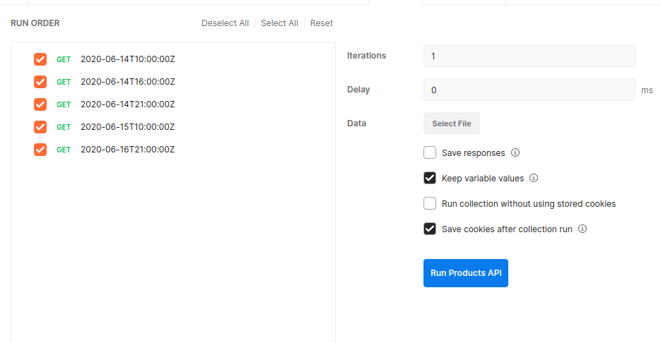
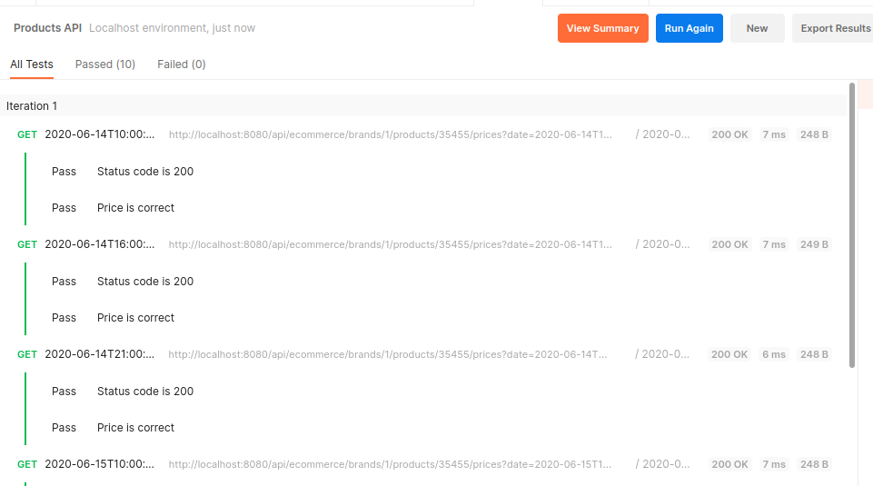

= AtSistemas Challenge

== Enunciado

En la base de datos de comercio electrónico de la compañía disponemos de la tabla PRICES que refleja el precio final (pvp) y la tarifa que aplica a un producto de una cadena entre unas fechas determinadas. A continuación se muestra un ejemplo de la tabla con los campos relevantes:

|===
|BRAND_ID |START_DATE |END_DATE |PRICE_LIST |PRODUCT_ID |PRIORITY |PRICE |CURR

|1 |2020-06-14-00.00.00 |2020-12-31-23.59.59 |1 |35455 |0 |35.50 |EUR
|1 |2020-06-14-15.00.00 |2020-06-14-18.30.00 |2 |35455 |1 |25.45 |EUR
|1 |2020-06-15-00.00.00 |2020-06-15-11.00.00 |3 |35455 |1 |30.50 |EUR
|1 |2020-06-15-16.00.00 |2020-12-31-23.59.59 |4 |35455 |1 |38.95 |EUR
|===

Campos:

* *BRAND_ID*: foreign key de la cadena del grupo (1 = ZARA).
* *START_DATE* , END_DATE: rango de fechas en el que aplica el precio tarifa indicado.
* *PRICE_LIST*: Identificador de la tarifa de precios aplicable.
* *PRODUCT_ID*: Identificador código de producto.
* *PRIORITY*: Desambiguador de aplicación de precios. Si dos tarifas coinciden en un rago de fechas se aplica la de mayor prioridad (mayor valor numérico).
* *PRICE*: precio final de venta.
* *CURR*: iso de la moneda.

Se pide:

Construir una aplicación/servicio en SpringBoot que provea una end point rest de consulta tal que:

* Acepte como parámetros de entrada: fecha de aplicación, identificador de producto, identificador de cadena.
* Devuelva como datos de salida: identificador de producto, identificador de cadena, tarifa a aplicar, fechas de aplicación y precio final a aplicar.

Se debe utilizar una base de datos en memoria (tipo h2) e inicializar con los datos del ejemplo, (se pueden cambiar el nombre de los campos y añadir otros nuevos si se quiere, elegir el tipo de dato que se considere adecuado para los mismos).

== Solución

Se ha implementado un endpoint rest reactivo utilizando Spring Boot 3 y H2.

=== Building

----
./mvnw clean package
----

=== Testing

----
./mvnw clean verify
----

=== Running

----
./mvnw spring-boot:run -f pom.xml
----

=== Documentation

http://localhost:8080/swagger-ui.html

=== Haciendo peticiones

*Postman*

Se proporciona una colección postman que se puede ser importada y ejecutada una vez esté e l servicio en ejecución:

*Curl*

También puede utilizar curl para hacer las peticiones al servicio:

----
curl --location 'http://localhost:8080/api/ecommerce/brands/1/products/35455/prices?date=2020-06-14T10:00:00Z' \
--header 'Accept: application/json'
----

=== Pruebas

Se ha implementado el escenario de pruebas sugerido utilizando Cucumber, además se ha añadido un escenario para el caso en le que no se encuentre tarifa con los parámetros proporcionados
